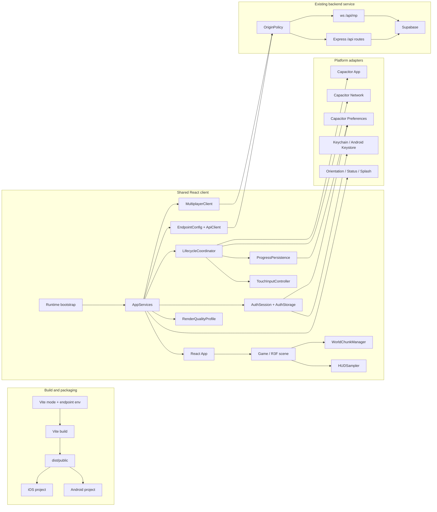
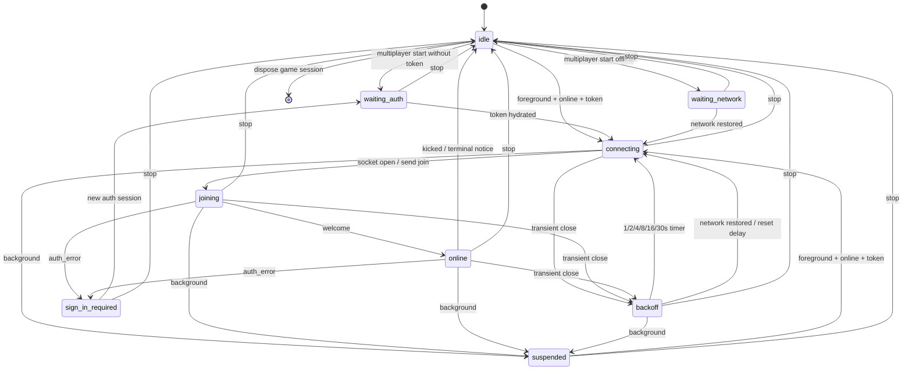

# Technical Design: Capacitor Mobile App

## 1. Overview

This design converts the existing Craftworld React/Vite/React Three Fiber client into installable iOS and Android applications while retaining one gameplay implementation and the existing Node/Express/`ws`/Supabase backend. Capacitor is a packaging and platform-services layer, not a second client.

The design addresses current mobile blockers in the repository:

- REST URLs are relative, the WebSocket URL is derived from `window.location`, and `sendBeacon` targets a relative URL.
- authentication storage is synchronously initialized from `localStorage` at module load;
- progress playtime includes background duration and the final save is browser-only;
- multiplayer owns a fixed two-second reconnect loop inside `RemotePlayers` and does not understand lifecycle or network state;
- `useWorld` retains every generated chunk, `World` renders every retained chunk, and `ChunkMesh` does not explicitly dispose memoized geometries;
- player coordinates are copied into React state every frame;
- renderer settings are fixed at desktop quality;
- touch input has fixed offsets and lacks sprint, held fire, handbrake, and complete social-panel controls.

### Goals

1. Preserve the browser build, backend routes, multiplayer message contract, account semantics, and desktop presentation.
2. Add reproducible native projects and release commands without forking gameplay code.
3. Put platform differences behind typed TypeScript interfaces that can be tested with fake clocks, storage, network, and sockets.
4. Bound chunk and GPU-resource growth before considering more complex meshing.
5. Make all required actions usable in landscape with touch only.
6. Establish TDD, cross-platform regression, device-performance evidence, and a strict profiling gate.

### Non-goals

- Replacing React Three Fiber, Three.js, Express, `ws`, or Supabase.
- Changing the passwordless account model or backend payload shapes.
- Persisting world edits across a terminated game session; requirements only require in-session background/resume retention.
- Synchronizing block edits between multiplayer clients.
- Implementing Web Worker meshing or greedy meshing in the initial conversion.
- Introducing a new UI framework or state-management library.

**Requirements:** 1.1, 2.14–2.15, 4.10, 8.10, 9.11, 13.1

## 2. System Architecture



The key boundary is `AppServices`: platform services are created once before React mounts and are injected through a small context. Existing module-level frame stores remain appropriate for hot paths, but I/O and lifecycle ownership move out of render components.

```ts
export interface AppServices {
  readonly runtime: RuntimeCapabilities;
  readonly endpoints: EndpointConfig;
  readonly api: ApiClient;
  readonly auth: AuthSession;
  readonly lifecycle: LifecycleCoordinator;
  readonly multiplayer: MultiplayerClient;
  readonly nativeShell: NativeShell;
  readonly quality: RenderQualityProfile;
}
```

**Requirements:** 1.1, 2.1, 3.1–3.2, 4.1, 5.8, 9.2, 10.1

## 3. Technology and Dependency Decisions

### 3.1 Capacitor version

Use the Capacitor 7 line, with `@capacitor/core`, `@capacitor/cli`, `@capacitor/ios`, and `@capacitor/android` aligned to `7.4.4`. Capacitor 7 is selected as the smallest compatible native-runtime addition for the repository's existing Node 20 toolchain and because the chosen secure-storage release is explicitly built and published against the Capacitor 7.4.4 family. Moving to a second new major at the same time would add migration risk without satisfying an additional requirement; Capacitor 8 can be evaluated separately after mobile release acceptance. New dependencies must be exact versions in `package.json` and `package-lock.json`; no caret or tilde ranges are allowed. The task phase must re-read registry metadata and record every exact official-plugin and test-tool pin before installation. All hand-authored mobile TypeScript remains under strict mode and may not introduce an untyped `any` value.

Required official plugins are limited to:

- `@capacitor/app` for foreground/background events;
- `@capacitor/network` for native connectivity changes;
- `@capacitor/preferences` for device ID and token-free pending progress;
- `@capacitor/screen-orientation` for runtime landscape locking;
- `@capacitor/status-bar` for foreground status-bar control;
- `@capacitor/splash-screen` for explicit splash dismissal.

A pinned `@capacitor/assets` development tool may generate native icon and splash catalogs from checked-in source assets. Generated native assets remain checked in, so normal builds do not depend on regeneration.

### 3.2 Secure storage selection

Use `@aparajita/capacitor-secure-storage@7.1.6` for native session tokens. This version explicitly targets Capacitor 7, depends on the Capacitor 7.4.4 family, uses iOS Keychain, and encrypts Android values with a key held by Android Keystore. The package had v7 releases in the preceding 12 months and its upstream repository continued receiving releases/commits, satisfying the maintenance requirement. Its web implementation is deliberately not used because it stores web values in unencrypted local storage and would not preserve the existing key/fallback contract as explicitly as a local adapter.

The secure plugin is configured without iCloud synchronization. A session token must remain local to the installation/device context. Plugin access failure never falls back to Preferences or ordinary WebView storage on native; it produces a recoverable signed-out state.

### 3.3 Testing support

Testing-only additions may include Vitest, fast-check, jsdom, React Testing Library, user-event, and Playwright. They are justified by pure state-machine/property tests, DOM interaction tests, and the required desktop regression suite. No production dependency is introduced solely for testing.

**Requirements:** 1.11, 3.3–3.6, 3.13–3.14, 12.7–12.9

## 4. Native Project and Build Design

### 4.1 Capacitor configuration

Add `capacitor.config.ts` with a fixed release identity:

```ts
import type { CapacitorConfig } from '@capacitor/cli';

const config: CapacitorConfig = {
  appId: 'com.asikmydeen.craftworld',
  appName: 'Craftworld',
  webDir: 'dist/public',
  server: {
    hostname: 'localhost',
    iosScheme: 'capacitor',
    androidScheme: 'https',
  },
  plugins: {
    SplashScreen: { launchAutoHide: false },
  },
};

export default config;
```

Production configuration must not contain `server.url`; release applications always load bundled files. The resulting native WebView origins are `capacitor://localhost` on iOS and `https://localhost` on Android. These exact origins are inputs to the backend allowlist, not hard-coded server exceptions.

The app ID is immutable after first store publication. Signing team, keystore path, passwords, and provisioning material are injected by the local/CI signing environment and never committed.

### 4.2 Checked-in projects and platform floors

- `ios/App` is committed with deployment target `17.0` in the Xcode project and package-manager configuration. Supported interface orientations are landscape-left and landscape-right only.
- `android` is committed with `minSdkVersion = 31`. `compileSdkVersion` and `targetSdkVersion` follow the selected Capacitor 7 project template. The app activity uses sensor-landscape so both landscape rotations are accepted and sets `windowSoftInputMode="adjustResize"` so login/chat keyboards resize the WebView and emit the visual-viewport change used by layout gating.
- Xcode 16 or later and JDK 21/compatible Android Studio are documented toolchain prerequisites.
- Native privacy manifests, app labels, package names, version codes, and release schemes are checked in.

### 4.3 Commands

The existing `npm run build` remains `vite build` and continues to write `dist/public` for the web service. New commands are wrappers with deterministic ordering:

| Command | Behavior |
|---|---|
| `npm run build` | Existing web build; same-origin endpoint mode by default. |
| `npm run build:native` | Validate native production endpoints, then run Vite in the native production mode. |
| `npm run cap:sync` | `build:native`, then synchronize iOS and Android. |
| `npm run cap:sync:ios` | `build:native`, then synchronize only iOS. |
| `npm run cap:sync:android` | `build:native`, then synchronize only Android. |
| `npm run native:build:ios` | Sync iOS, archive the checked-in Release scheme, then export an IPA using environment-provided signing. |
| `npm run native:build:android` | Sync Android, then run the Gradle release bundle task to produce an AAB. |
| `npm run native:verify-idempotent` | Run sync twice and fail if the second run changes tracked files. |

Small Node ESM scripts under `scripts/native/` own endpoint validation and native command composition. They pass arguments as arrays to child processes rather than shell-concatenating signing values.

### 4.4 Orientation, status bar, splash, and assets

`NativeShell.prepare()` runs before gameplay input is enabled. On native it locks landscape and hides the status bar; on web it is a no-op. It repeats the lock/hide operations after resume because operating-system UI can be restored while backgrounded. Failure leaves input gated and presents a recoverable shell error rather than starting in an unsupported layout.

Checked-in source assets:

- `resources/icon.png`: branded square master with safe margins and no transparency where a platform disallows it;
- `resources/icon-foreground.png` and `resources/icon-background.png`: Android adaptive icon sources;
- `resources/splash-landscape.png`: branded landscape splash master.

Generated iOS asset catalogs and Android mipmap/drawable resources are committed and validated by both native build tools. The splash remains visible while platform services hydrate. A React root-shell layout effect calls `nativeShell.markReactReady()`, which waits for one settled visual-viewport frame and then calls `SplashScreen.hide()` exactly once.

**Requirements:** 1.2–1.10, 6.1–6.3, 6.7–6.10, 12.2–12.4

## 5. Runtime Bootstrap and Data Flow

`src/main.tsx` changes from immediate rendering to an asynchronous bootstrap. Platform listeners are attached early, but account resume cannot start until storage hydration completes.

```mermaid
sequenceDiagram
  participant Main as main.tsx
  participant Runtime as Runtime bootstrap
  participant Shell as NativeShell
  participant Storage as AuthStorage
  participant Life as LifecycleCoordinator
  participant React as React App
  participant API as Backend

  Main->>Runtime: createAppServices(import.meta.env, window.location)
  Runtime->>Shell: prepare() (native landscape/status)
  Runtime->>Life: attach platform + network listeners
  Runtime->>Storage: hydrate token and device ID
  Storage-->>Runtime: AuthSnapshot or recoverable failure
  Runtime->>React: render AppServicesProvider + App
  React->>API: resume() after hydration
  API-->>React: account or signed-out result
  React->>Shell: markReactReady() after settled root layout
  Shell-->>React: splash hidden; input gate opens
```

```ts
export type RuntimePlatform = 'web' | 'ios' | 'android';

export interface RuntimeCapabilities {
  platform: RuntimePlatform;
  isNative: boolean;
  isTouchPrimary: boolean;
}

export async function createAppServices(
  env: ImportMetaEnv,
  browserLocation: Pick<Location, 'origin' | 'protocol'>,
): Promise<AppServices>;
```

Bootstrap failures are typed:

- endpoint configuration failure is fatal and names the invalid environment variable;
- native orientation/status failure is visible and retryable before gameplay;
- auth storage failure mounts the account screen in a signed-out/retry state without exposing values;
- network unavailability is not a bootstrap failure.

The selected `RenderQualityProfile` is part of `AppServices`, so `Game` receives it before the first `<Canvas>` is constructed.

**Requirements:** 2.2–2.7, 3.2, 3.11–3.12, 6.2–6.3, 6.9, 9.2

## 6. Endpoint Configuration and Server Origin Policy

### 6.1 Typed endpoint resolution

Add `src/config/endpoints.ts`:

```ts
export interface EndpointConfig {
  readonly apiBaseUrl: URL;
  readonly webSocketUrl: URL;
  readonly source: 'build-override' | 'browser-origin';
}

export interface EndpointBuildInput {
  readonly target: 'web' | 'native';
  readonly production: boolean;
  readonly apiBaseUrl?: string;
  readonly webSocketUrl?: string;
}

export function resolveEndpointConfig(
  input: EndpointBuildInput,
  browserOrigin: string,
): EndpointConfig;

export function resolveApiUrl(config: EndpointConfig, apiPath: string): URL;
```

Build variables are `VITE_API_BASE_URL` and `VITE_WEBSOCKET_URL`; `VITE_BUILD_TARGET` distinguishes web and native packaging.

Resolution rules:

1. A native production build requires both absolute overrides. API must be HTTPS; multiplayer must be WSS and include `/api/mp`.
2. A web build with neither override uses the browser origin. HTTPS becomes WSS, HTTP becomes WS, and multiplayer receives `/api/mp`. In a production runtime, the resolved browser origin must be HTTPS; otherwise startup fails closed.
3. Providing only one override is invalid. Supplied production endpoints reject malformed URLs, credentials in URLs, fragments, localhost/loopback, HTTP, or WS.
4. Non-production Vite modes may use HTTP/WS and loopback endpoints.
5. Query parameters, local storage, remote config, and native preferences cannot change endpoints at runtime.
6. Every API call, leaderboard query, progress request, and page-hide beacon goes through `resolveApiUrl`; every WebSocket is created from `webSocketUrl`.

Web omission is not a missing production endpoint: it compiles an explicit same-origin resolver into the web build. Native production has no such fallback.

### 6.2 API client

Refactor `src/game/account.ts` around an injected `ApiClient` while preserving public account types and route payloads.

```ts
export interface ApiError extends Error {
  readonly status: number;
  readonly code: string;
}

export interface ApiClient {
  request<T>(path: string, init?: RequestInit): Promise<T>;
  beacon(path: string, body: unknown): boolean;
}
```

The client adds JSON headers and the in-memory bearer token. A 401 invokes `AuthSession.rejectCurrentToken()`; it does not log request bodies or tokens. `beacon` uses an absolute configured URL and keeps the existing server-supported token-in-body behavior only for the final web save.

### 6.3 Explicit HTTP origin handling

Add `server/origin-policy.mjs` and parse `ORIGIN_ALLOWLIST` once at process startup. Production examples are:

```text
https://block-game.asikmydeen.com,capacitor://localhost,https://localhost
```

Development adds `http://localhost:5173` explicitly. Wildcards, opaque `null`, malformed entries, paths, queries, and fragments are rejected at startup.

The middleware runs before JSON parsing and all `/api` routes:

- requests with an approved `Origin` receive that exact value in `Access-Control-Allow-Origin` plus `Vary: Origin`;
- preflight permits `GET`, `POST`, and `OPTIONS`, and the `Content-Type` and `Authorization` headers;
- credentials/cookies are not enabled because authentication uses bearer tokens;
- a supplied unapproved origin receives 403 before route code;
- HTTP requests without `Origin` remain allowed for same-host navigation, health checks, and non-browser tooling.

### 6.4 WebSocket upgrade handling

Change `setupMultiplayer` to use `WebSocketServer({ noServer: true })`. The HTTP server owns `upgrade`, verifies the exact path and origin, and only then calls `handleUpgrade`. Browser WebSocket upgrades with missing, malformed, or unapproved origins are rejected with 403 and the socket is destroyed before a `connection` event. Originless WS can be enabled only by an explicit non-production setting for local tooling; it is denied in production.

Before this policy is enabled in production, an early physical-device characterization test captures only the WebSocket `Origin` header (never the token or join payload) from release-mode iOS and Android builds and verifies it equals the configured `capacitor://localhost` or `https://localhost` origin. A missing or different native header blocks release and requires correcting the Capacitor scheme/hostname or transport design; the server must not silently broaden the production policy to wildcard or originless access.

CORS/origin checks are defense in depth, not authentication. The existing join token lookup, one-live-connection rule, message types, and Supabase service-role isolation remain unchanged.

**Requirements:** 2.1–2.15, 4.7, 5.1, 12.9–12.11

## 7. Authentication Storage and Session Design

### 7.1 Storage contract

```ts
export interface AuthSnapshot {
  readonly token: string | null;
  readonly deviceId: string | null;
}

export interface AuthStorage {
  readToken(): Promise<string | null>;
  writeToken(token: string): Promise<void>;
  clearToken(): Promise<void>;
  readDeviceId(): Promise<string | null>;
  writeDeviceId(deviceId: string): Promise<void>;
}

export interface AuthSession {
  hydrate(): Promise<AuthSnapshot>;
  getToken(): string | null; // synchronous only after hydrate settles
  getDeviceId(): string | null;
  setAuthenticated(token: string, deviceId: string): Promise<void>;
  rejectCurrentToken(): Promise<void>;
  logout(): Promise<void>;
  subscribe(listener: () => void): () => void;
}
```

`AuthSession` serializes mutations and owns the single hydrated in-memory token used by both REST and multiplayer. Consumers never call platform storage on a frame path.

### 7.2 Platform adapters

| Runtime | Session token | Device ID |
|---|---|---|
| iOS | `@aparajita/capacitor-secure-storage` / Keychain | Capacitor Preferences |
| Android | `@aparajita/capacitor-secure-storage` / Keystore-backed encryption | Capacitor Preferences |
| Web | `localStorage['blockgame.token']`, then memory fallback | `localStorage['blockgame.deviceId']`, then memory fallback |

The web adapter catches read, write, and removal failures independently. Its memory map is always updated first, so a throwing/private-mode storage object still supports the current page lifetime and preserves existing keys when local storage is available.

The native adapter never writes the token to Preferences. It uses the existing key names within their respective backends, disables cloud synchronization, and returns generic error codes. Token values are excluded from URLs, Preferences, pending progress, diagnostics, analytics, and logs.

### 7.3 Account flow ordering

- Bootstrap awaits `hydrate()` before `resume()`.
- If a hydrated token exists, `/api/auth/me` runs first.
- On 401, token clearing completes before `/api/auth/resume` is sent with the device ID.
- Login/device resume writes the returned token and device ID before publishing authenticated account state or enabling gameplay.
- Logout is best effort against the server, always clears the token, and retains the device ID.
- Mid-session REST 401 or multiplayer `auth_error` clears the token, stops automatic multiplayer retries, and transitions the app to a recoverable sign-in-required state.
- A storage failure does not silently use insecure native storage. The login screen offers Retry Storage and remains signed out.

**Requirements:** 3.1–3.14, 5.1, 5.11, 12.5–12.8

## 8. Lifecycle and Progress Persistence

### 8.1 Normalized runtime events

```ts
export type AppVisibility = 'foreground' | 'background';

export interface RuntimeEventSource {
  getVisibility(): Promise<AppVisibility>;
  getNetworkAvailable(): Promise<boolean>;
  onVisibility(listener: (value: AppVisibility) => void): Unsubscribe;
  onNetwork(listener: (available: boolean) => void): Unsubscribe;
  onPageHide(listener: () => void): Unsubscribe;
}
```

The native adapter uses Capacitor App state/pause/resume and Network status events. The web adapter uses `visibilitychange`, `pagehide`, `online`, `offline`, and `navigator.onLine`. `LifecycleCoordinator` deduplicates repeated native/browser events into one state transition and fans it out in a fixed order:

1. close the foreground clock;
2. snapshot and initiate progress persistence;
3. suspend multiplayer;
4. reset touch input;
5. expose background state to UI/render scheduling.

On foreground it prepares the native shell, waits for auth hydration, opens the foreground clock, retries pending progress, enables input after layout settles, and then allows multiplayer to reconnect.

### 8.2 Latest-only pending progress

```ts
export interface ProgressState {
  score: number;
  zombieKills: number;
  deaths: number;
  ownedWeapons: readonly string[];
  playSeconds: number;
}

export interface PendingProgressSnapshot {
  schemaVersion: 1;
  accountId: string;
  revision: number;
  capturedAtMs: number;
  value: ProgressState;
}

export interface PendingProgressStore {
  read(accountId: string): Promise<PendingProgressSnapshot | null>;
  write(snapshot: PendingProgressSnapshot): Promise<void>;
  clearIfOwnerAndRevision(accountId: string, revision: number): Promise<void>;
}
```

The snapshot is token-free and account-scoped. Native stores it in Preferences under a versioned account key; web uses local storage with memory fallback. A canonical comparison sorts `ownedWeapons` and coalesces duplicate state. There is never a per-account queue—only the newest revision for that account—and the coordinator loads/retries only the currently authenticated account's slot. Separate dormant account slots exist solely to prevent an offline account switch from applying one player's progress to another.

`ProgressPersistence` behavior:

- Each discrete progress change updates the in-memory newest snapshot, asynchronously replaces that account's durable slot, and schedules a two-second foreground network debounce.
- A background event synchronously captures current progress and foreground playtime. Before any await, it starts both `PendingProgressStore.write(snapshot)` and, when online, the API request. The coordinator then awaits the Preferences write as its first completion dependency and records callback-to-resolution latency; the snapshot counts as durable only when that promise resolves. Both target-device suites must prove completion within 250 ms, not merely invocation, or the release is rejected.
- A successful response clears durable state only if both its account owner and revision still match the pending snapshot. An older acknowledgement or response from a prior auth generation cannot clear or publish over newer/current-account progress.
- Failure/offline keeps the newest snapshot for its owner. Foreground/network recovery retries only the current account's slot after auth hydration.
- Logout/account switching cancels the active debounce/retry generation before the token changes. A newly authenticated account loads only its own slot; in-flight responses and dormant snapshots owned by another account are never applied or retried under the new token.
- On cold launch, pending storage is read only after account resume and only by `account.id`, so a snapshot can never be dispatched under a different account.
- Web `pagehide` retains the existing best-effort beacon through `API_Base_URL`; native lifecycle uses durable storage plus ordinary authenticated fetch.

### 8.3 Foreground playtime

`ForegroundClock` stores accumulated foreground milliseconds plus an optional active interval start. `currentSeconds(now)` is computed on demand; no one-second React timer is required. Background closes the interval and resume starts a new one. The account's existing `playSeconds` remains the base value.

World edits, score, health, inventory, selected mode, and entity refs remain owned by the mounted game session. Background does not unmount `Game`; process suspension therefore preserves them. Only account progress is durable across process termination, matching the requirement boundary.

**Requirements:** 4.1–4.11, 7.8, 12.12–12.13

## 9. Multiplayer State Machine

Move transport ownership out of `RemotePlayers.tsx` into `src/game/multiplayerClient.ts`. `RemotePlayers` becomes a scene adapter that subscribes to membership and interpolates Three.js groups from frame-owned target refs.

```ts
export type MultiplayerPhase =
  | 'idle'
  | 'waiting-auth'
  | 'waiting-network'
  | 'connecting'
  | 'joining'
  | 'online'
  | 'backoff'
  | 'suspended'
  | 'sign-in-required';

export interface MultiplayerClient {
  start(session: MultiplayerSession): void;
  stop(): void;
  send(message: ClientMessage): boolean;
  getSnapshot(): MultiplayerUiSnapshot;
  subscribe(listener: () => void): Unsubscribe;
}
```



### Resource and protocol rules

- A monotonically increasing connection generation invalidates callbacks from stale sockets.
- One field owns the current socket, one owns the reconnect timeout, and one owns the 100 ms position publisher. Starting a replacement always cancels/closes existing resources first.
- Background cancels backoff/publish timers immediately and requests socket close within one second. No retry is scheduled while suspended.
- Foreground with network and token starts one immediate attempt. Network restoration resets backoff to one second and starts one attempt.
- Transient failures schedule deterministic delays of 1, 2, 4, 8, 16, then 30 seconds, capped at 30.
- `onopen` sends `join` only. Position publishing starts after `welcome`, guaranteeing authenticated join precedes state messages.
- `auth_error` clears the session token through `AuthSession`, enters `sign-in-required`, and disables retries. The existing duplicate-session `kicked` event remains terminal for that game session.
- Any close clears target refs and React membership before publishing offline/suspended status.
- Incoming roster transforms mutate `targetsById` refs. React membership changes only if the ordered identity set changes; status/membership stores use equality checks. Score/emote UI changes may notify at the existing throttled rate.
- Chat, emotes, kill feed, and server message shapes remain unchanged.

**Requirements:** 5.1–5.12, 10.1, 10.5, 12.12–12.13

## 10. World Chunk Manager and Geometry Lifecycle

### 10.1 Data model

Replace the unbounded logic in `useWorld` with a testable `WorldChunkManager` and retain a hook facade for React.

```ts
export interface ChunkCoord { x: number; z: number }
export type ChunkKey = `${number},${number}`;
export type LocalBlockKey = `${number},${number},${number}`;

export interface ActiveChunkSnapshot {
  readonly center: ChunkCoord;
  readonly keys: readonly ChunkKey[];
  readonly membershipVersion: number;
}

export interface WorldChunkManager {
  readonly seed: number;
  getActiveSnapshot(): ActiveChunkSnapshot;
  getRetainedChunk(key: ChunkKey): ReadonlyMap<LocalBlockKey, BlockType> | undefined;
  getBlock(wx: number, wy: number, wz: number): BlockType | undefined;
  setBlock(wx: number, wy: number, wz: number, type: BlockType): void;
  updatePlayerPosition(wx: number, wz: number): void;
  subscribeActive(listener: () => void): Unsubscribe;
  dispose(): void;
}
```

Internal state is split into:

1. `fullChunks`: evictable generated maps, at most the 9×9 retention window after stabilization;
2. `authoredOverlay`: immutable, session-scoped sparse updates from the existing house, road, forest, and park generators;
3. `editOverlay`: sparse player changes independent of full chunks, including explicit `'air'` values;
4. `meshRevisionByChunk`: invalidation counters consumed by `ChunkMesh`.

Generation merge order is base terrain → authored overlay → player edit overlay. The authored overlay is created once per game session and remains separate from player edits; this prevents city decoration data from being misclassified while still regenerating identical session scenery. If a player edit equals the effective base-plus-authored value, its overlay entry can be removed.

The seed is generated once when the game session is created and remains stable until `Game` unmounts. Existing negative-coordinate floor/local-coordinate behavior is preserved.

### 10.2 Active and retention windows

- Active radius is 3: exactly 7×7/49 keys centered on the current player chunk.
- Retention radius is 4: at most 9×9/81 full chunks.
- Before publishing a new active set, all new active chunks and the one-chunk seam ring are generated and overlays are applied. An active edge therefore never observes a missing retained neighbor during meshing.
- `updatePlayerPosition` computes the chunk coordinate and returns immediately if unchanged. Frame calls do not rebuild sets or notify React within the same chunk.
- Crossing a boundary transactionally generates missing retained chunks, publishes one new active snapshot, and then immediately evicts every `fullChunks` entry outside the new 9×9 retention window. Unmounting meshes retain their own map references until React cleanup, so manager eviction does not invalidate the commit in progress.
- The one-second stable-position criterion is treated as an upper-bound validation checkpoint, not an eviction debounce. Continuous boundary crossings therefore cannot postpone eviction or grow `fullChunks` beyond the current retention window.
- Eviction deletes only `fullChunks`; authored/player overlays and the stable seed remain.
- `World.tsx` renders only `getActiveSnapshot().keys`, never every retained chunk.

### 10.3 Edits and seam correctness

An explicit `'air'` edit must override regenerated solid terrain. After eviction and regeneration every overlay entry is applied before the active key is published.

A block change increments the edited chunk's mesh revision. If the local coordinate is on an X or Z boundary, it also increments the applicable cardinal and corner-neighbor revisions because face culling and ambient occlusion sample across seams. This fixes the current latent issue where a neighbor's `blocks` reference does not change after a seam edit and therefore does not remesh.

### 10.4 Geometry disposal

`ChunkMesh` keeps the current synchronous mesher for initial scope but moves geometry creation to a named pure `buildChunkGeometry` function. A React effect disposes opaque, transparent, and water geometries whenever a geometry set is replaced and on unmount. Custom materials/render targets receive equivalent owner cleanup.

Removing an active key causes React cleanup in the same commit; instrumentation verifies disposal before the second completed R3F frame. `WorldChunkManager.dispose()` clears timers, listeners, retained chunks, and overlays when the game session ends.

**Requirements:** 8.1–8.12, 10.4, 11.5, 13.1

## 11. Rendering Quality and Frame/React Separation

### 11.1 Immutable quality profiles

```ts
export type ShadowMode = 'off' | 'basic' | 'pcf-soft';

export interface RenderQualityProfile {
  readonly id: 'mobile' | 'desktop';
  readonly dpr: readonly [min: number, max: number];
  readonly antialias: boolean;
  readonly shadowMode: ShadowMode;
  readonly shadowMapSize: number;
  readonly shadowCasterBudget: number;
  readonly bloom: boolean;
  readonly starCount: number;
  readonly decorativeLightBudget: number | 'all';
}
```

| Setting | Mobile | Desktop |
|---|---:|---:|
| DPR | `[1, 1.5]` | existing R3F desktop range |
| Antialias | false | true |
| Shadow mode | basic | PCF soft |
| Shadow map | 1024 | 2048 |
| Shadow casters | 1 | current one directional caster |
| Bloom | false | true |
| Stars | 750 | 3000 |
| Decorative real lights | nearest 8 | all current lights |

`selectRenderQuality(runtime)` runs during bootstrap. The profile is immutable for the session because antialiasing is a WebGL context creation option. `<Canvas>` receives `dpr`, `gl.antialias`, and `shadows` from the profile on its first render. Mobile omits the bloom composer branch; desktop retains Bloom and Vignette. Tone mapping remains ACES for both.

Street-lamp meshes/glow plates remain visible on mobile. A decorative-light registry includes every point or spot light that is not the primary directional light; the mobile selector assigns a fixed pool to the nearest candidates and enforces a combined maximum of eight across both light types. The current implementation's candidates are street-lamp point lights, but headlights or future spot lights consume the same budget. Selection is recomputed when the player crosses a chunk or moves beyond a coarse threshold, and Three.js light objects are mutated through refs without a frame-level React update. Desktop renders the existing complete set. Quality code does not import or alter collision, reach, entity, weapon, or world-state constants.

### 11.2 HUD sampling

Remove `onPositionChange` → `setPlayerPos(pos.clone())` from the Player frame loop. `Player` continues to update `playerPosRef` directly. A scheduler-driven hook samples that ref every 200 ms while foregrounded:

```ts
export interface HudCoordinates { x: number; y: number; z: number }

export interface HudSampler {
  start(source: ReadonlyVector3, publish: (value: HudCoordinates) => void): void;
  suspend(): void;
  resume(): void;
  stop(): void;
}
```

Values are rounded to the displayed precision before comparison. Equal values retain the previous object and do not call the React setter. This caps coordinates at five updates per second. Chunk membership uses its own chunk-coordinate comparison and does not depend on HUD state.

Frame loops continue to mutate refs and Three.js objects for movement, camera, physics, car/animal movement, animation, and remote interpolation. Integration instrumentation spies on the frame-owned bridges/store notifications and fails if steady frame callbacks invoke a React setter. Discrete health, score, inventory, modal, status, and membership events remain React state and a frame-stepped integration test requires each changed value to be committed before the next displayed frame.

During steady movement, the only periodic root-level source is the HUD sampler at no more than five publications per second; chunk membership publishes only on a boundary and multiplayer transforms stay outside React. This leaves explicit margin below the ten-root-commits-per-second ceiling, which the Playwright React Profiler gate measures rather than infers.

**Requirements:** 9.1–9.11, 10.1–10.7, 11.1–11.4

## 12. Responsive Mobile UI and Touch Parity

### 12.1 Viewport and safe-area shell

Update the viewport meta tag with `viewport-fit=cover`. `src/index.css` defines central custom properties:

```css
:root {
  --app-height: 100dvh;
  --safe-top: env(safe-area-inset-top, 0px);
  --safe-right: env(safe-area-inset-right, 0px);
  --safe-bottom: env(safe-area-inset-bottom, 0px);
  --safe-left: env(safe-area-inset-left, 0px);
  --control-size: 48px;
  --control-gap: 8px;
}
```

A `useVisualViewport` hook writes `visualViewport.width/height/offset*` into CSS variables. The root shell uses those values instead of `100vw`/`100vh`. Android's checked-in `adjustResize` setting ensures the WebView reports software-keyboard size changes. On resize/orientation change, an input gate closes, layout variables update, and the gate reopens after two animation frames with stable viewport dimensions. Input focus independently closes the typing gate immediately, so movement/combat remains neutral even if a platform delays or omits a viewport event. This guarantees the next accepted gameplay touch uses current bounds.

Safe-area-aware containers replace independent fixed offsets:

- top-left HUD, top-center status, and top-right menu groups;
- bottom-center hotbar/weapon drawer;
- left joystick/sprint cluster;
- right look/action/vehicle cluster;
- modal viewport with `max-height`, `max-width`, and touch scrolling.

All primary controls are at least 48×48 CSS pixels with at least 8 pixels between hit regions. Inline visual styles may remain, matching the repository, but shared geometry and inset calculations move to CSS classes/custom properties so every overlay uses one layout contract.

### 12.2 Touch input controller

Expand the existing module-level hot-path store rather than putting analog input into React:

```ts
export interface TouchInputSnapshot {
  moveX: number;
  moveY: number;
  lookDX: number;
  lookDY: number;
  jumpHeld: boolean;
  sprintHeld: boolean;
  primaryHeld: boolean;
  placeRequested: boolean;
  handbrakeHeld: boolean;
}

export interface TouchInputController {
  readFrame(): TouchInputSnapshot;
  begin(control: TouchControl, pointerId: number): void;
  end(pointerId: number): void;
  cancel(pointerId: number): void;
  addLook(pointerId: number, dx: number, dy: number): void;
  setGate(reason: 'layout' | 'typing' | 'background', blocked: boolean): void;
  resetAll(): void;
}
```

Pointer capture associates each contact with one control and guarantees `pointerup`, `pointercancel`, lost capture, blur, background, and typing all release the correct held state. Separate pointer IDs permit joystick movement, look pad, and one action concurrently. Pressed visual state may use local React state; simulation state remains in the controller.

`primaryHeld` unifies mine/melee/ranged trigger intent. A non-automatic weapon fires on the rising edge; an automatic weapon continues at its configured attack rate while held. Release, cancellation, background, typing, or cooldown immediately prevents additional shots. `handbrakeHeld` is consumed by Cars; `sprintHeld` is consumed by Player.

### 12.3 Complete action matrix

Both keyboard/mouse and touch controls dispatch the same named game commands; desktop bindings remain unchanged.

| Action group | Touch path |
|---|---|
| Account | Existing login form with 48px submit/suggest/cancel controls; mode screen switch-user control. |
| Mode/start | Free Play/Multiplayer cards and full-screen Play overlay. |
| Move/look/jump/sprint | Left joystick, right look pad, Jump hold, Sprint hold. |
| Mine/melee/ranged/automatic fire | Contextual Primary trigger; tap for one action, hold for automatic weapon cadence. |
| Place/use block | Place/Use trigger; interactive blocks retain contextual behavior. |
| Choose block | Safe-area hotbar or scrollable block drawer with 48px entries. |
| Choose/buy/equip weapon | Weapon drawer and shop actions with 48px entries. |
| Car | Enter/Exit, joystick drive, Handbrake hold, Repair. |
| Animal | Mount/Dismount context action. |
| Camera/day-night | Dedicated camera and day/night menu actions. |
| Menu/help/shop | Safe-area top action group; every panel has a touch close control. |
| Death/respawn | Existing death panel with a 48px Respawn action. |
| Chat | Chat toggle, focused composer, explicit Send and Cancel; both restore gameplay input after viewport stabilization. |
| Player list | Player-list toggle plus explicit close action. |
| Emotes | Four 48px emote actions, one per existing emote. |

When login/chat input has focus or the software keyboard changes the visual viewport, the input gate calls `resetAll()` and suppresses movement/combat until focus exits and layout settles. Gameplay containers disable selection, callout/context menus, overscroll, and navigation gestures; modal content retains vertical touch scrolling.

Native runtime always enables touch mode and hides the selector. Web retains touch detection and its optional touch-mode behavior.

**Requirements:** 6.4–6.6, 7.1–7.13, 12.14–12.15

## 13. Error Handling and Observability

| Boundary | Behavior |
|---|---|
| Invalid endpoint build input | Fail before Vite/native sync; message names `VITE_API_BASE_URL` or `VITE_WEBSOCKET_URL`, never a secret. |
| Unapproved HTTP/WS origin | 403/rejected upgrade before route/connection; log only normalized origin and reason. |
| Auth storage read/write failure | Clear in-memory token, enter recoverable signed-out state, retain no secret in message/log. |
| Mid-session 401/auth error | Clear secure token, stop multiplayer retry, preserve token-free progress pending for sign-in recovery. |
| Pending progress write failure | Keep newest snapshot in memory, show non-blocking save-pending state, retry on foreground/network; record generic diagnostic. |
| Transient multiplayer failure | Clear remote state, transition offline/backoff, keep one capped retry timer. |
| Native shell operation failure | Keep gameplay input disabled and offer Retry; browser branch remains unaffected. |
| Chunk generation failure | Do not publish a partially prepared active snapshot; retain prior center and report a bounded diagnostic. |
| WebGL creation failure | Preserve the existing user-facing fallback. |

Development-only counters expose active chunks, retained chunks, pending progress revision, socket/timer counts, and root React commits. Production logs contain categorical states and timing but no tokens, message bodies, device IDs, or Supabase credentials.

**Requirements:** 2.4, 2.12–2.15, 3.11–3.13, 4.5, 5.8–5.11, 12.17

## 14. Likely File Changes

| Path | Change |
|---|---|
| `package.json`, `package-lock.json` | Exact Capacitor/plugin/test pins and deterministic build/sync/native/test commands. |
| `capacitor.config.ts` | App identity, bundled web directory, local schemes, splash policy. |
| `ios/`, `android/` | Checked-in native projects, OS floors, orientations, signing placeholders, assets. |
| `resources/` | Branded icon/adaptive-icon/splash masters. |
| `scripts/native/*` | Endpoint validation, native release wrappers, idempotence/evidence checks. |
| `.env.example` | Document client endpoint modes and server `ORIGIN_ALLOWLIST`; keep service role server-only. |
| `vite.config.ts` | Load/validate target-aware endpoint mode while preserving `dist/public` and dev proxy. |
| `index.html`, `src/index.css` | `viewport-fit=cover`, safe-area/visual-viewport variables, gesture and modal rules. |
| `src/main.tsx` | Async `AppServices` bootstrap before React render. |
| `src/platform/runtime.ts` | Runtime capability detection. |
| `src/platform/nativeShell.ts` | Orientation, status bar, splash readiness; web no-op. |
| `src/platform/runtimeEvents.ts` | Native/web lifecycle and network adapters. |
| `src/config/endpoints.ts` | Typed endpoint resolution, normalization, production validation. |
| `src/game/apiClient.ts` | Absolute REST/beacon routing, auth header, typed errors. |
| `src/game/authStorage.ts` | Storage/session interfaces and serialized in-memory auth state. |
| `src/game/authStorage.web.ts` | Existing local keys plus memory fallback. |
| `src/game/authStorage.native.ts` | Secure token plus Preferences device ID. |
| `src/game/account.ts` | Inject ApiClient/AuthSession; preserve public account operations and shapes. |
| `src/game/lifecycle.ts` | Coordinator, foreground clock, normalized transition order. |
| `src/game/progressPersistence.ts` | Latest-only account-scoped durable snapshot state machine. |
| `src/game/multiplayerClient.ts` | Lifecycle/network-aware socket state machine and backoff. |
| `src/game/multiplayer.ts` | Equality-safe UI store and frame-owned transform target store. |
| `src/game/worldChunkManager.ts` | Active/retention windows, seed, overlays, eviction, mesh revisions. |
| `src/game/useWorld.ts` | Thin React external-store facade or replacement export. |
| `src/game/renderQuality.ts` | Typed profiles and pre-Canvas selection. |
| `src/game/hudSampler.ts` | Five-hertz equality-aware coordinate sampler. |
| `src/game/touchInput.ts` | Multi-pointer held/edge state and global reset/input gate. |
| `src/App.tsx` | Hydrated service use, recoverable auth state, shell-ready signal. |
| `src/pages/Game.tsx` | Remove per-frame coordinate state path; wire lifecycle/progress/profile/commands. |
| `src/components/Player.tsx` | Frame ref ownership, chunk-boundary signal, sprint/held-primary input. |
| `src/components/RemotePlayers.tsx` | Visual membership/interpolation only; no socket/retry ownership. |
| `src/components/World.tsx` | Render active keys only. |
| `src/components/ChunkMesh.tsx` | Pure geometry builder input, mesh revisions, explicit disposal. |
| `src/components/StreetLamps.tsx` | Quality-budgeted nearest-light pool. |
| `src/components/TouchControls.tsx` | Safe-area clusters, pointer ownership, sprint/fire/handbrake. |
| `src/components/GameUI.tsx` | Responsive groups, 48px controls, command callbacks, touch parity. |
| `src/components/SocialUI.tsx` | Touch chat/player close controls, safe-area modal behavior, input gating. |
| `src/components/InteractionUI.tsx` | Safe-area scrolling and explicit touch close behavior. |
| `server/origin-policy.mjs` | Strict allowlist parsing and HTTP/upgrade decisions. |
| `server/index.mjs` | Origin middleware before routes; inject policy into multiplayer setup. |
| `server/mp.mjs` | `noServer` upgrade integration while preserving message contract. |
| `src/**/*.test.ts(x)`, `server/**/*.test.mjs`, `tests/e2e/*` | Unit/property/integration/browser regression coverage. |
| `validation/mobile/*` | Evidence schema/template; generated run artifacts remain outside normal source commits unless intentionally retained. |

## 15. Test-Driven Development and Validation Strategy

### 15.1 TDD sequence

Every behavior-changing implementation slice follows RED → GREEN → REFACTOR:

1. Add the smallest failing unit/property/integration test named `should ... when ...`.
2. Run it and retain the expected failure reason.
3. Add only enough production code to pass.
4. Run the targeted test, then affected suites.
5. Refactor without changing behavior.
6. Before a release-candidate commit, run typecheck, full tests, web build, sync/native builds where available, and regression/device gates.

Native project scaffolding and generated assets are configuration/generated-code exceptions, but they still receive failing smoke/validator checks before configuration is accepted.

### 15.2 Automated suites

| Suite | Main coverage |
|---|---|
| Vitest unit | Endpoint normalization, auth session, web fallback storage, foreground clock, pending revision logic, quality selection, HUD sampler, touch input. |
| fast-check property | Correctness properties below, minimum 100 generated cases per property. |
| Vitest state-machine | Lifecycle interleavings, multiplayer resources/backoff/protocol order, chunk movement/eviction/edit regeneration. |
| React Testing Library | Bootstrap ordering, signed-out recovery, modal/chat controls, command dispatch, touch reset, equal-value suppression, frame-loop setter guards, and discrete-event commit-before-next-frame assertions. |
| Server integration | Real ephemeral HTTP server preflight/rejection and approved/denied `ws` upgrades; unchanged API/WS contract examples. |
| Playwright | Core web regression, same-origin endpoint fallback, desktop rendering settings, responsive/touch browser smoke, root commit profiling hook. |
| Native build smoke | Clean sync, iOS compile/archive, Android bundle, project floors/orientations/assets, exact embedded production endpoints. |
| Native device integration | Completed Preferences-write latency, secure/auth storage routing, actual WebSocket Origin headers, lifecycle/network resource counts, and native shell behavior. |

Each property test includes a comment/tag in this format:

```text
Feature: capacitor-mobile-app, Property N: <property title>
```

### 15.3 Device validation evidence

Each release candidate creates an evidence directory keyed by immutable build ID:

```text
validation/mobile/<build-id>/
  manifest.json
  ios-device.json
  android-device.json
  touch-matrix-ios.json
  touch-matrix-android.json
  lifecycle-network-ios.json
  lifecycle-network-android.json
  performance-ios.json
  performance-android.json
  artifacts/...
```

The manifest records git commit, package-lock hash, selected Capacitor and secure-storage versions, the compatibility source/check date, the latest qualifying upstream release or commit and its date, endpoint mode (hosts only), native version/build numbers, artifact checksums, test command results, and failed criterion IDs. Device reports record device model, OS version, orientation, timestamps, tester/automation identity, and links/checksums for screenshots, screen recordings, profiler exports, and OS logs.

Required physical-device flows:

- install/launch, account login/resume/switch, free play, multiplayer, background/resume, termination/relaunch;
- capture and verify each native WebSocket `Origin` value before production origin enforcement, without recording credentials or payloads;
- measure background-callback-to-durable-Preferences-resolution and background-callback-to-save-initiation, both against the 250 ms criteria;
- five background cycles of at least 30 seconds with save/socket/edit counters;
- two 30-second network interruptions with pending REST save and multiplayer recovery;
- every Touch Action Matrix entry without keyboard/mouse;
- bounding-box evidence for every primary touch target in both landscape rotations;
- the exact 10-minute representative session on iPhone 13-class iOS 17+ and Pixel 7-class Android 12+ hardware.

Performance reports include build ID, device, OS, average FPS, minute-2 and minute-10 resident memory, percent growth, maximum active/retained chunks, crashes/not-responding/memory-pressure events, and representative-session checklist timestamps. Native Instruments/Android Studio profiler measurements are authoritative for resident memory; browser-only JS memory estimates are not accepted.

### 15.4 Profiling gate

Initial acceptance first applies bounded chunks, quality profiles, and React/frame separation. If either device averages below 45 FPS after those changes pass:

1. collect a main-thread CPU profile during the representative session;
2. rank frame-time contributors and record percentages;
3. authorize a separately scoped worker/greedy-meshing evaluation only when chunk generation or mesh construction is both top-three and at least 20% of measured main-thread time;
4. otherwise optimize the largest measured contributor.

The separate evaluation must compare complexity, face/AO equivalence, worker transfer costs, memory, and device FPS before any production adoption.

**Requirements:** 11.1–11.7, 12.1–12.17, 13.1–13.5

## 16. Correctness Properties

A property is a behavior that must hold across all valid generated inputs and event sequences. Infrastructure, native plugin behavior, visual layout, and physical-device performance remain example/smoke/integration tests; the properties below target low-cost logic owned by this codebase. Redundant criteria are consolidated so each property adds unique validation value.

### Property 1: Endpoint resolution is secure, complete, and authoritative

For any build target, mode, endpoint-variable pair, browser origin, and API path, endpoint resolution either returns separate normalized API and WebSocket URLs that satisfy that mode's transport rules and route all REST/WebSocket creation through those values, or rejects the input with the invalid variable's name; when web overrides are both omitted, the URLs are derived from the current browser origin.

**Validates: Requirements 2.1, 2.2, 2.3, 2.4, 2.5, 2.6, 2.8, 2.9**

### Property 2: Origin approval is exact membership

For any finite configured origin allowlist and any supplied origin, the origin policy approves the origin if and only if its normalized value is an exact member of the allowlist; no wildcard, substring, suffix, malformed, or opaque origin is approved.

**Validates: Requirements 2.10**

### Property 3: Authentication transitions preserve hydration and persistence ordering

For any storage latency/outcome and any sequence of hydrate, resume, login, token rejection, logout, and device-resume events, no resume request starts before hydration settles, authenticated gameplay is not published before successful token/device persistence, a rejected token is cleared before device resume, logout retains the device ID while clearing the token, and REST and multiplayer consumers observe the same in-memory token.

**Validates: Requirements 3.2, 3.7, 3.8, 3.9, 3.10, 3.12**

### Property 4: Web auth storage preserves compatibility or current-page state

For any token/device-ID strings and any web Storage implementation that either succeeds or throws on individual operations, the web adapter uses the existing `blockgame.token` and `blockgame.deviceId` keys when available and otherwise preserves read-after-write/clear semantics in memory for the current adapter lifetime.

**Validates: Requirements 3.5, 3.6**

### Property 5: Pending progress converges to the newest unacknowledged state

For any foreground progress-update timeline, duplicate lifecycle events, account switches, network availability, save failures, storage delays, and out-of-order acknowledgements, the coordinator dispatches only after two quiet seconds unless lifecycle forces an immediate attempt, retains at most the newest snapshot for each account, never dispatches a snapshot under a non-owner token, never lets an older/prior-auth acknowledgement clear or publish over newer/current-account progress, coalesces equivalent states, and retries once the owning account's prerequisites become eligible.

**Validates: Requirements 4.1, 4.2, 4.5, 4.6, 4.9**

### Property 6: Playtime equals accumulated foreground duration

For any monotonic timeline of foreground and background transitions, reported session playtime equals the sum of foreground intervals plus the account base and excludes every background interval regardless of duplicate events.

**Validates: Requirements 4.8**

### Property 7: Multiplayer lifecycle maintains one eligible transport

For any ordering of game start/stop, auth hydration, foreground/background, network changes, socket opens/closes, and transient failures, the multiplayer client owns at most one socket, one publisher, and one reconnect timer; it never reconnects or publishes in background, closes resources within the deadline, reconnects once when eligible, and uses delays 1, 2, 4, 8, 16, 30, 30... seconds until reset.

**Validates: Requirements 5.1, 5.2, 5.3, 5.4, 5.5, 5.6, 5.7, 5.8**

### Property 8: Multiplayer protocol and UI transitions are ordered and minimal

For any connection close/reconnect/auth result and any roster stream, remote state is cleared before offline publication, every connection sends authenticated join before state publication, authentication rejection reaches a retry-free sign-in-required state, and transform-only or identical status/membership data does not replace the React-visible snapshot.

**Validates: Requirements 5.9, 5.10, 5.11, 5.12, 10.5**

### Property 9: Touch terminal events restore neutral input

For any combination of active pointer-owned movement, look, jump, sprint, primary fire, placement, or handbrake controls, cancellation of a pointer resets its associated state, while background or typing/layout gates reset all analog deltas and held/edge states before the next frame read.

**Validates: Requirements 7.7, 7.8, 7.9**

### Property 10: Held automatic fire obeys cadence and termination

For any automatic weapon fire rate, cooldown state, hold duration, and sequence ending in release, pointer cancellation, background, or typing, shots occur no faster than the weapon cadence while eligible and no shot occurs after the first terminal event.

**Validates: Requirements 7.13**

### Property 11: Chunk windows are centered, bounded, and notification-stable

For any spawn coordinate and player movement path including continuous movement and negative coordinates, the active set is the 49 keys in radius three around the current player chunk, same-chunk movement does not change membership or notify React, and each completed recenter evicts all full chunks outside radius four so the retained total is at most 81 (and remains so after one second at a stable center).

**Validates: Requirements 8.1, 8.2, 8.3, 8.4, 8.5, 8.6, 10.4**

### Property 12: Edited chunk regeneration is a stable round trip

For any session seed, chunk coordinate, authored baseline, and finite set of player edits including explicit air, evicting and regenerating the full chunk with that seed produces the same unedited values and reapplies every player edit, while lifecycle background/resume events leave the overlay unchanged.

**Validates: Requirements 8.8, 8.9, 8.10, 8.11**

### Property 13: Seam edits preserve neighbor mesh semantics

For any edit on a chunk edge or corner, every adjacent chunk whose face-culling or ambient-occlusion lookup can observe that block receives a mesh revision, and regenerated seam lookup decisions equal those of the same non-evicted reference world.

**Validates: Requirements 8.12**

### Property 14: Runtime selection enforces quality-profile limits

For any runtime capability snapshot, native iOS/Android selects the mobile profile before renderer creation and that profile has DPR at most 1.5, antialiasing off, at most one shadow caster with maps at most 1024, bloom off, at most 750 stars, and at most eight nearest decorative lights; desktop web selects the profile with antialiasing, soft shadows, bloom, 3000 stars, and all current decorative lights.

**Validates: Requirements 9.2, 9.3, 9.4, 9.5, 9.6, 9.7, 9.8, 9.9, 9.10**

### Property 15: Visual quality is simulation-invariant

For any valid collision, interaction, entity, weapon, and world-state scenario, running the simulation with mobile or desktop visual profile values produces equivalent gameplay outcomes and world state.

**Validates: Requirements 9.11**

### Property 16: HUD sampling is bounded and equality-aware

For any continuous position trace and monotonic clock, the HUD sampler publishes no more than five coordinate values in any one-second interval and does not publish when the newly rounded display value equals the current display value.

**Validates: Requirements 10.2, 10.3**

### Property 17: Release acceptance is all-or-nothing and diagnostic

For any set of required validation criterion results, the release gate accepts if and only if every required criterion passes, and every rejection reports each failed criterion identifier.

**Validates: Requirements 12.17**

### Property 18: Advanced meshing authorization follows measured evidence

For any prerequisite status, per-device FPS results, and ranked main-thread contributor profile, the profiling gate requests profiling only after requirements 8–10 pass and a device misses 45 FPS; it authorizes a separate meshing evaluation only when chunk generation or mesh construction is top-three and at least 20%, otherwise keeps meshing deferred and selects the largest measured contributor.

**Validates: Requirements 13.2, 13.3, 13.4, 13.5**

## 17. Requirements Traceability

| Requirement | Design sections | Primary validation |
|---|---|---|
| 1. Capacitor platforms/builds | 3, 4, 14 | Build/type smoke, clean sync, native artifacts, idempotence. |
| 2. Endpoints/origins/backend | 5, 6, 13 | Properties 1–2, HTTP/WS integration, contract/security scans. |
| 3. Auth storage | 3, 5, 7 | Properties 3–4, adapter tests, native backend/relaunch evidence. |
| 4. Lifecycle progress | 8 | Properties 5–6, browser pagehide, native timing and relaunch flows. |
| 5. Multiplayer lifecycle | 9 | Properties 7–8, fake socket/clock tests, device network cycles. |
| 6. Native landscape/assets | 4, 5, 12 | Native metadata/build smoke, launch/resume screenshots, layout gating. |
| 7. Touch parity | 12 | Properties 9–10, DOM tests, complete device touch matrix. |
| 8. Bounded chunks | 10 | Properties 11–13, disposal integration, representative counters. |
| 9. Quality profiles | 5, 11 | Properties 14–15, Canvas construction test, desktop visual regression. |
| 10. Frame/React separation | 9, 10, 11, 15 | Properties 8, 11, 16; frame-loop setter guard, next-frame discrete-event test, and React Profiler/commit gate. |
| 11. Performance/memory | 11, 15 | Two physical-device representative-session reports. |
| 12. Release validation | 15 | Property 17 plus build, browser, server, native, touch, lifecycle, network, and performance evidence. |
| 13. Profiling gate | 10, 15 | Property 18 and retained CPU-profile ranking evidence. |

## 18. External References

- [Capacitor 7 migration and toolchain requirements](https://capacitorjs.com/docs/v7/updating/7-0)
- [Capacitor App lifecycle API](https://capacitorjs.com/docs/v7/apis/app)
- [Capacitor Network API](https://capacitorjs.com/docs/v7/apis/network)
- [Capacitor Preferences API](https://capacitorjs.com/docs/apis/preferences)
- [`@aparajita/capacitor-secure-storage` package versions](https://www.npmjs.com/package/@aparajita/capacitor-secure-storage?activeTab=versions)
- [`@aparajita/capacitor-secure-storage` source and maintenance history](https://github.com/aparajita/capacitor-secure-storage)

Content from external references was rephrased for compliance with licensing restrictions.
